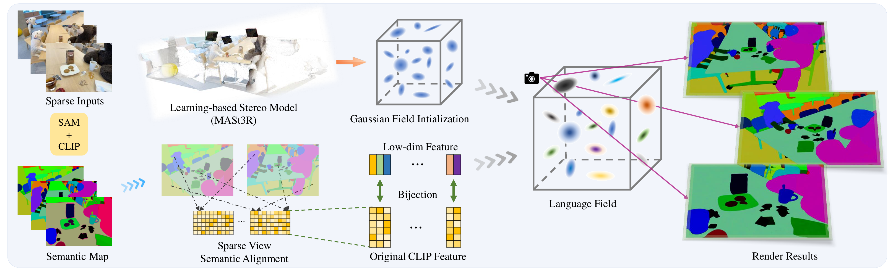

# SparseLGS: Sparse View Language Embedded Gaussian Splatting

[Project page](https://ustc3dv.github.io/SparseLGS) · [Paper](https://arxiv.org/abs/2412.02245)

Official implementation of **SparseLGS**, a pose-free 3D language-field method
that reconstructs a scene from only 3–4 input views. SparseLGS estimates the
camera poses and initial point cloud, aligns inconsistent semantics across
sparse views, and optimizes language-embedded 3D Gaussians for open-vocabulary
segmentation and localization.

## Method Pipeline



The main release includes the final three-stage semantic alignment, compact
feature/codebook recovery, RGB-assisted semantic training, configurable point
limits, MASt3R/DUSt3R/VGGT initializers, and fast LERF evaluation.

## Installation

The tested environment uses Linux, Python 3.10, PyTorch 2.1.0, CUDA 12.1, and
an NVIDIA GPU. A CUDA toolkit with `nvcc` is required to build the rasterizer.

```bash
conda create -n sparselgs python=3.10 -y
conda activate sparselgs

pip install "setuptools<70"
pip install -r requirements.txt
pip install --no-build-isolation ./submodules/diff-gaussian-rasterization
pip install --no-build-isolation ./submodules/simple-knn
pip install --no-build-isolation ./submodules/segment-anything-langsplat-main
pip install -e ./RoMa-main
```

If the CUDA extensions cannot find PyTorch libraries at runtime:

```bash
export LD_LIBRARY_PATH="$CONDA_PREFIX/lib/python3.10/site-packages/torch/lib:${LD_LIBRARY_PATH:-}"
```

### Model weights

Create `ckpt/` and place the required weights there:

```text
ckpt/
├── DUSt3R_ViTLarge_BaseDecoder_512_dpt.pth
├── MASt3R_ViTLarge_BaseDecoder_512_catmlpdpt_metric.pth  # optional
├── model.pt                                               # VGGT, optional
└── sam_vit_h_4b8939.pth
```

The DUSt3R and MASt3R weights are available from the official Naver
repositories. SAM ViT-H is available from Meta. VGGT can download its weights
from Hugging Face or use a local `model.pt`. OpenCLIP weights are downloaded on
first use. All checkpoint paths can be overridden with environment variables.

```bash
mkdir -p ckpt
wget -P ckpt https://download.europe.naverlabs.com/ComputerVision/DUSt3R/DUSt3R_ViTLarge_BaseDecoder_512_dpt.pth
wget -P ckpt https://download.europe.naverlabs.com/ComputerVision/MASt3R/MASt3R_ViTLarge_BaseDecoder_512_catmlpdpt_metric.pth
wget -O ckpt/sam_vit_h_4b8939.pth https://dl.fbaipublicfiles.com/segment_anything/sam_vit_h_4b8939.pth
# Optional VGGT initializer:
wget -O ckpt/model.pt https://huggingface.co/facebook/VGGT-1B/resolve/main/model.pt
```

The paper uses MASt3R as its primary initializer. DUSt3R is bundled and is the
zero-extra-checkout default. To use the other initializers:

```bash
git clone --recursive https://github.com/naver/mast3r.git mast3r
git clone https://github.com/facebookresearch/vggt.git vggt
```

## Data preparation

Put the complete image set for each scene in:

```text
data/<scene>/images/
```

The initialization stage uniformly selects `N_VIEWS` images and creates the
working directory below. Early versions of SparseLGS used DUSt3R for geometry
initialization, so the directory was originally named `dust3r_<N>_views`.
MASt3R and VGGT support was added later, but the original name was retained for
backward compatibility with the training, rendering, and evaluation code.
Therefore, the directory is still called `dust3r_<N>_views` regardless of the
selected initializer.

```text
data/<scene>/
├── images/                         # original images
└── dust3r_<N>_views/
    ├── images/                     # selected sparse inputs
    ├── sparse/0/                   # COLMAP-style cameras, poses, depths, PLY
    ├── language_features/          # SAM/OpenCLIP 512D features
    ├── language_features_dim3/     # compact 3D features
    └── language_features_origin*/  # alignment backups, generated on demand
```

## Run SparseLGS

The following command runs the complete paper pipeline on a four-view scene:

```bash
DATASET=teatime \
N_VIEWS=4 \
INITIALIZER=mast3r \
RUN_GEOMETRY_INIT=1 \
RUN_RGB_TRAIN=1 \
RUN_SAM_CLIP=1 \
RUN_AUTOENCODER=1 \
RUN_LANG_FUSION=1 \
RUN_FEATURE_TRAIN=1 \
RUN_RENDER=1 \
FEATURE_LEVELS="1 2 3" \
bash new_ins_train.sh
```

For the bundled DUSt3R initializer, use `INITIALIZER=dust3r`.
`RUN_DUST3R_INIT` remains available as a backward-compatible alias for
`RUN_GEOMETRY_INIT`.

The stages are independently switchable, so completed outputs can be reused.
For example, to retrain and render only the semantic Gaussians:

```bash
DATASET=teatime N_VIEWS=4 \
RUN_GEOMETRY_INIT=0 RUN_RGB_TRAIN=0 RUN_SAM_CLIP=0 \
RUN_AUTOENCODER=0 RUN_LANG_FUSION=0 \
RUN_FEATURE_TRAIN=1 RUN_RENDER=1 \
bash new_ins_train.sh
```

You can use a JSON configuration and still override individual values:

```bash
CONFIG=configs/pipeline.example.json bash new_ins_train.sh
CONFIG=configs/pipeline.example.json DATASET=teatime N_VIEWS=4 bash new_ins_train.sh
```

Important controls:

| Variable | Default | Meaning |
|---|---:|---|
| `INITIALIZER` | `dust3r` | `dust3r`, `mast3r`, or `vggt` |
| `N_VIEWS` | 4 for LERF scenes, otherwise 3 | sparse input count |
| `ITER` | 1000 | geometry and semantic iterations |
| `FEATURE_LEVELS` | `2` | SAM granularities to train (`0`–`3`) |
| `MAX_INIT_POINTS` | 0 | cap initial point count; 0 keeps all |
| `MAX_INIT_SCALE` | 0 | optional maximum initial Gaussian scale |
| `OPTIM_POSE` | 1 | refine training-view poses |
| `START_CHECKPOINT` | automatic | explicit geometry checkpoint |
| `FEATURE_CKPT_ITER` | 1000 | semantic checkpoint used for rendering |

Run `bash -n new_ins_train.sh` for a shell-level check and inspect
`configs/pipeline.example.json` for all stage, alignment, and render controls.

## Outputs

Geometry training writes:

```text
output/<scene>/<N>_views_<base_level>/chkpnt<ITER>.pth
```

Each semantic granularity writes a separate model and rendered feature maps:

```text
output/<scene>/<N>_views_<level>/
└── train/ours_<ITER>/
    ├── renders/
    └── renders_npy/
```

## LERF evaluation

After rendering all requested feature levels, run:

```bash
python eval/evaluate_iou_loc_fast.py \
  --dataset_name teatime \
  --feat_dir output/teatime \
  --source_path data/teatime/dust3r_4_views \
  --json_folder /path/to/lerf/teatime/annotations \
  --output_dir eval_result \
  --n_views 4 \
  --feature_levels "1 2 3" \
  --total_iters 1000 \
  --mask_thresh 0.6
```

This reports mean IoU and localization accuracy and stores JSON/CSV summaries.
Use `--cpu` for codebook recovery on CPU.

## Troubleshooting

- `ModuleNotFoundError: diff_gaussian_rasterization/simple_knn`: install the two
  CUDA extensions with `--no-build-isolation` after installing PyTorch.
- `ModuleNotFoundError: pkg_resources`: use `setuptools<70` in the tested
  PyTorch 2.1 environment.
- `ImportError: libc10.so`: add PyTorch's `lib` directory to `LD_LIBRARY_PATH`.
- NumPy ABI errors: keep `numpy==1.26.4` and rebuild the CUDA extensions.
- Missing `language_features_dim3`: run with `RUN_AUTOENCODER=1`, or provide
  previously generated compact features.
- Missing alignment camera files: rerun initialization; alignment requires
  `intrinsics.pt`, `poses.pt`, and `depths.pt` under `sparse/0`.

## Citation

If SparseLGS is useful in your research, please cite:

```bibtex
@article{hu2024sparselgs,
  title   = {SparseLGS: Sparse View Language Embedded Gaussian Splatting},
  author  = {Jun Hu and Zhang Chen and Zhong Li and Yi Xu and Juyong Zhang},
  journal = {arXiv preprint arXiv:2412.02245},
  year    = {2024}
}
```

## Acknowledgements

The rendering module in SparseLGS is developed based on
[3D Gaussian Splatting](https://github.com/graphdeco-inria/gaussian-splatting)
and [LangSplat](https://github.com/minghanqin/LangSplat), with modifications for
sparse-view reconstruction and language-feature rendering.

SparseLGS also uses [SAM](https://github.com/facebookresearch/segment-anything)
for region segmentation, [OpenCLIP](https://github.com/mlfoundations/open_clip)
for language features, and [RoMa](https://github.com/Parskatt/RoMa) for
cross-view matching. Camera poses and initial point clouds are estimated with
[MASt3R](https://github.com/naver/mast3r),
[DUSt3R](https://github.com/naver/dust3r), or
[VGGT](https://github.com/facebookresearch/vggt). We sincerely thank the
authors of these projects for making their work publicly available.
